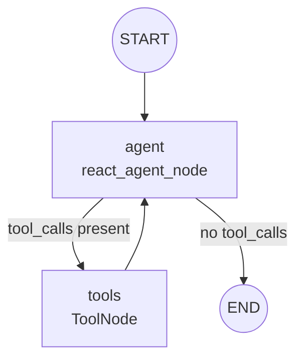

# AgentDesk Agent Architecture

The AgentDesk backend uses **LangGraph** to orchestrate a **ReAct (Reason + Act)** agent. The agent handles all query types — knowledge base lookups, CRM data retrieval, and live actions — within a single unified reasoning loop. There is no upfront intent classification or branching.

---

## 🗺️ Graph Topology

The graph is a standard ReAct loop: the LLM reasons at every step and decides whether to call a tool or produce a final answer.



### How it works

1. **`START` → `agent`**: The user's question is added to the message history as a `HumanMessage` and passed to the LLM. The LLM is bound with all available tools and a system prompt that explains when to use each one.

2. **`agent` → `tools`** *(conditional)*: If the LLM's response contains one or more `tool_calls`, LangGraph's `tools_condition` routes execution to the `ToolNode`, which executes the requested tool functions and appends `ToolMessage` results back to the message history.

3. **`tools` → `agent`** *(loop)*: After tool execution, control returns to the `agent` node. The LLM re-reasons with the updated history — it may call more tools or produce a final answer.

4. **`agent` → `END`**: When the LLM produces an `AIMessage` with no `tool_calls`, `tools_condition` routes to `END`. The final answer is the content of this last `AIMessage`.

A hard **recursion limit of 5 steps** acts as a circuit breaker to prevent runaway LLM loops.

---

## 🧰 Tools

All tools are registered in `agent/tools/__init__.py` as `ALL_TOOLS` and bound to the LLM in the agent node. The LLM selects which tools to call based solely on its own reasoning.

| Tool | Description |
|---|---|
| `retrieve_kb` | Searches the pgvector knowledge base. Internally rewrites the query for multi-turn follow-ups before hitting the vector store. |
| `get_customer` | Fetches the authenticated customer's account details. |
| `get_customer_invoices` | Retrieves all invoices for the authenticated customer. |
| `get_customer_subscriptions` | Retrieves subscription details for the authenticated customer. |
| `get_customer_tickets` | Retrieves all support tickets for the authenticated customer. |
| `create_ticket` | Creates a new support ticket attributed to the authenticated user. |

### `retrieve_kb` in detail

RAG is not a separate graph branch — it is encapsulated entirely inside the `retrieve_kb` tool (`agent/tools/knowledge_base.py`):

1. **Query rewriting**: The tool reads the current message history and uses `REWRITE_PROMPT` to rewrite conversational follow-up questions into standalone search queries. For first-turn or already-standalone questions, the rewrite is idempotent.
2. **Vector retrieval**: The rewritten query is passed to `PgVectorRetriever`, which runs a cosine similarity search against the `pgvector` index. Results below `RAG_SIMILARITY_THRESHOLD` are discarded.
3. **Return**: The tool returns a formatted string of chunks with `[Source: slug]` headers. The LLM reads this as a `ToolMessage` and synthesizes the final answer in its next reasoning step.

This means the LLM can combine CRM data and knowledge base results in a single turn by calling multiple tools before producing its answer.

---

## 🗃️ State

`AgentState` is intentionally minimal — only two fields:

```python
class AgentState(TypedDict):
    question: str                                        # Original user question (fallback reference)
    messages: Annotated[list[BaseMessage], add_messages] # Full message history — the sole data conduit
```

Fields from the previous architecture (`intent`, `search_query`, `docs`, `answer`, `sources`) are removed. The final answer and sources are extracted from the message list **after** `graph.invoke()` returns in `chain.py`:
- **Answer**: the content of the last `AIMessage` in the current turn's messages.
- **Sources**: `[Source: slug]` headers parsed from any `retrieve_kb` `ToolMessage`s in the current turn.

### Separation of State and Infrastructure

The SQLAlchemy `Session` and JWT identity fields (`user_id`, `customer_id`, `user_email`, `user_role`) are passed via LangGraph's **Runtime Context API** (`AgentContext` dataclass) rather than stored in `AgentState`. This keeps state JSON-serializable for the PostgreSQL checkpointer.

---

## 🧠 Memory and Persistence

Multi-turn conversation memory is implemented using `langgraph-checkpoint-postgres`.

1. **Initialization**: During server startup, a process-scoped `ConnectionPool` is established in `agent/memory.py`.
2. **Execution**: When `POST /agent/ask` receives a `thread_id`, the graph is compiled with a `PostgresSaver` checkpointer. LangGraph replays all prior `messages` for that thread before `START`.
3. **Persistence**: On reaching `END`, LangGraph automatically writes the updated message list back to the checkpoint table.
4. **Stateless mode**: If no `thread_id` is provided, the graph is compiled without a checkpointer and runs fully statelessly.

To prevent sources from prior turns bleeding into the current turn's response, `chain.py` snapshots the message count **before** `graph.invoke()` and slices only the new messages afterwards.

---

## 👁️ Observability & Tracing

AgentDesk uses **LangSmith** for zero-code telemetry and execution tracing. 

Because the agent is built natively on `langchain-core` and `langgraph`, LangSmith automatically intercepts and traces the entire ReAct loop without requiring explicit decorators or tracking code inside the agent logic.

Traces capture:
1. Every ReAct iteration (the reasoning loop).
2. All LLM calls (both the ReAct reasoning and the internal query re-writer inside `retrieve_kb`), including exact prompts and generated completions.
3. Every tool invocation with its inputs and raw database outputs.
4. Token usage and latency per node.

Tracing is enabled simply by providing the `LANGSMITH_TRACING=true` and `LANGSMITH_API_KEY` environment variables. The variables are injected into `os.environ` via `load_dotenv()` at server startup (`app.py`), allowing LangChain's internal hooks to detect them dynamically.
