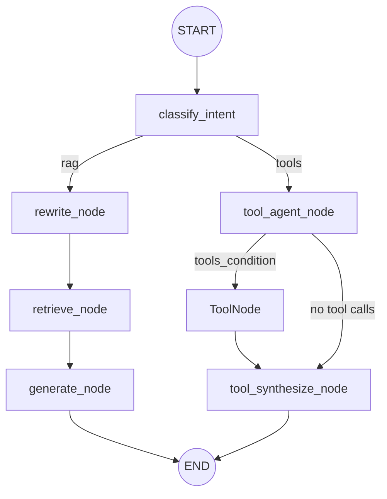

# TeamFlow Agent Architecture

The TeamFlow backend uses **LangGraph** to orchestrate its hybrid agent architecture. The agent handles both Retrieval-Augmented Generation (RAG) for knowledge base queries and specific CRM operations via tools. It features conversational memory and intelligent query routing to ensure accurate and context-aware responses.

---

## 🗺️ High-Level Topology

The graph utilizes an LLM-based intent classifier as the entry point, branching into a strict linear (acyclic) topology for either RAG or Tools execution:



### 1. `START` & Intent Classification (`classify_node`)
The entry point of the graph. The graph is initialized with the raw user `question`. The classifier node uses structured output to strictly categorize the query's intent into `rag` or `tools` and saves it to the state. 

### 2. The RAG Branch (`rag`)
If the intent is general platform knowledge or support documentation:
- **Rewrite Node (`rewrite_node`)**: Evaluates conversational history. If history exists, rewrites the question into a standalone query.
- **Retrieve Node (`retrieve_node`)**: Executes semantic vector search against the PostgreSQL `pgvector` database and retrieves document chunks.
- **Generate Node (`generate_node`)**: Synthesizes the final answer using Grok, citations, and appends the final turn to the conversation memory.

### 3. The Tools Branch (`tools`)
If the intent requires looking up specific CRM data (e.g., invoices, tickets, customer data):
- **Tool Agent Node (`tool_agent_node`)**: Evaluates the question and conversational history to generate explicit tool calls utilizing `bind_tools(ALL_TOOLS)`.
- **Tools Node (`ToolNode`)**: A standard LangGraph prebuilt node that executes the requested python functions against the PostgreSQL database.
- **Synthesize Node (`tool_synthesize_node`)**: Receives the raw tool outputs and synthesizes a clean, user-friendly final response.

### 4. `END`
The graph execution concludes. If a `thread_id` was provided, the checkpointer automatically saves the updated state (including new `messages` and tool outputs) back to PostgreSQL for the next turn.

---

## 🗃️ State Management

Information flowing through the graph is strictly typed via the `AgentState` `TypedDict`.

```python
class AgentState(TypedDict):
    question: str             # The raw user input
    intent: str               # The routed intent ("rag" or "tools")
    search_query: str         # The standalone query (RAG branch)
    docs: list[Document]      # KB chunks (RAG branch)
    answer: str               # The LLM generated answer (Both branches)
    sources: list[str]        # Array of article slugs (Both branches)
    
    # Reducer that appends new messages across turns
    messages: Annotated[list[BaseMessage], add_messages]
```

### Separation of State and Infrastructure
Database connection sessions (`Session`) are explicitly excluded from `AgentState` because they cannot be JSON-serialized for checkpointing. Instead, infrastructure dependencies are passed into the nodes dynamically using LangGraph's **Runtime Context API** (`Runtime[AgentContext]`).

---

## 🧠 Memory and Persistence

To facilitate multi-turn conversations, TeamFlow uses the `langgraph-checkpoint-postgres` library. 

1. **Initialization:** During server startup, a process-scoped `ConnectionPool` is established in `agent/memory.py`.
2. **Execution:** When the `/agent/ask` API receives a `thread_id`, the graph compiles with the `PostgresSaver`. 
3. **Replay & Persist:** LangGraph automatically pulls prior messages from the database before `START` and saves the updated state upon reaching `END`.

If a request arrives without a `thread_id`, the graph runs fully statelessly.
