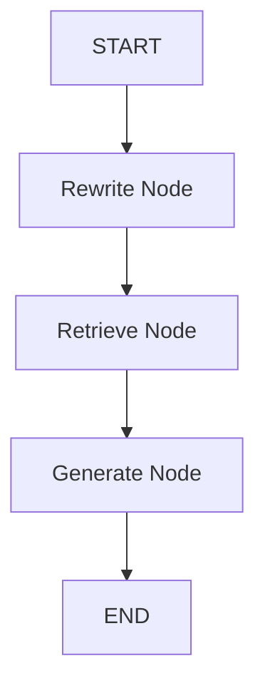

# TeamFlow Agent Architecture

The TeamFlow backend uses **LangGraph** to orchestrate its Retrieval-Augmented Generation (RAG) agent. The agent is designed as a sequential multi-step pipeline that features conversational memory and query rewriting to ensure highly accurate answers during multi-turn interactions.

---

## 🗺️ High-Level Topology

The graph follows a strict linear (acyclic) topology:



### 1. `START`
The entry point of the graph. The graph is initialized with the raw user `question`. If a `thread_id` is provided, the `PostgresSaver` checkpointer seamlessly loads the prior conversation history into the state's `messages` before executing the first node.

### 2. Rewrite Node (`rewrite_node`)
**Purpose:** Ensure the search query is fully self-contained.
- Evaluates the conversation history (`messages`).
- If history exists, it uses an LLM to rewrite the current user question into a standalone query (e.g., changing "How much does it cost?" into "How much does the Enterprise plan cost?").
- If there is no history, it simply passes the original `question` forward as the `search_query`.
- **Output:** Populates the `search_query` field in the state.

### 3. Retrieve Node (`retrieve_node`)
**Purpose:** Fetch relevant contextual knowledge.
- Takes the newly generated `search_query`.
- Executes a semantic vector search against the PostgreSQL `pgvector` database.
- Filters out any chunks that fall below the predefined `RAG_SIMILARITY_THRESHOLD`.
- **Output:** Populates the `docs` field in the state with the retrieved document chunks.

### 4. Generate Node (`generate_node`)
**Purpose:** Synthesize the final grounded answer.
- Compiles a prompt containing the conversation history, the user's raw question, and the extracted text from `docs`.
- Invokes the Grok LLM to generate the final response.
- Extracts and deduplicates the `article_slug` metadata from the chunks to form the source citations.
- Appends the current question and the new answer to the `messages` array for future context.
- **Output:** Populates the `answer` and `sources` fields.

### 5. `END`
The graph execution concludes. The checkpointer automatically saves the updated state (including the new `messages`) back to PostgreSQL for the next turn.

---

## 🗃️ State Management

Information flowing through the graph is strictly typed via the `RAGState` `TypedDict`.

```python
class RAGState(TypedDict):
    question: str             # The raw user input
    search_query: str         # The standalone query (created by rewrite)
    docs: list[Document]      # KB chunks (created by retrieve)
    answer: str               # The LLM generated answer (created by generate)
    sources: list[str]        # Array of article slugs (created by generate)
    
    # Reducer that appends new [HumanMessage, AIMessage] pairs across turns
    messages: Annotated[list[BaseMessage], add_messages]
```

### Separation of State and Infrastructure
Database connection sessions (`Session`) are explicitly excluded from `RAGState` because they cannot be JSON-serialized for checkpointing. Instead, infrastructure dependencies are passed into the nodes dynamically using LangGraph's **Runtime Context API** (`Runtime[RAGContext]`).

---

## 🧠 Memory and Persistence

To facilitate multi-turn conversations, TeamFlow uses the `langgraph-checkpoint-postgres` library. 

1. **Initialization:** During server startup, a process-scoped `ConnectionPool` is established in `agent/memory.py`.
2. **Execution:** When the `/agent/ask` API receives a `thread_id`, the graph compiles with the `PostgresSaver`. 
3. **Replay & Persist:** LangGraph automatically pulls prior messages from the database before `START` and saves the updated state upon reaching `END`.

If a request arrives without a `thread_id`, the graph runs fully statelessly.
